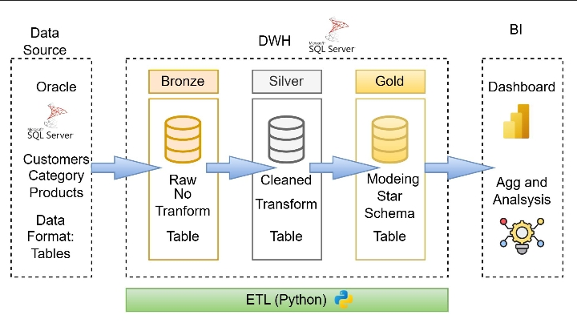

# Oracle to SQL Server Data Warehouse ETL

## 📌 Project Overview

This project implements an end-to-end **Data Engineering ETL Pipeline** that extracts data from an Oracle database, transforms and cleans the data using Python, and loads it into a structured **SQL Server Data Warehouse**.

The pipeline follows a **Medallion Architecture** approach to organize the data into Bronze, Silver, and Gold layers, producing clean and analysis-ready data for Business Intelligence and Power BI reporting.

---

## 🏗️ Project Architecture



---

## 🔄 ETL Pipeline

The project follows three main stages:

### 1. Extract

Data is extracted from the source **Oracle Database**.

The extraction process collects data from multiple source tables and prepares it for further processing.

### 2. Transform

Python is used to process and transform the extracted data.

The transformation process includes:

* Data cleaning
* Handling missing values
* Removing duplicates
* Data type conversion
* Data validation
* Data standardization
* Business rule implementation
* Preparing data for dimensional modeling

### 3. Load

The transformed data is loaded into **SQL Server Data Warehouse** tables.

The final warehouse structure is designed to support:

* Business Intelligence
* Data Analysis
* Reporting
* Power BI dashboards

---

## 🥉 Bronze Layer

The Bronze Layer stores the extracted data with minimal transformation.

Its main purpose is to preserve the source data and provide a reliable raw-data layer for the ETL process.

### Responsibilities

* Store raw extracted data
* Maintain source-level information
* Provide traceability
* Serve as the first stage of the data pipeline

---

## 🥈 Silver Layer

The Silver Layer contains cleaned and transformed data.

At this stage, the pipeline performs data quality and transformation operations.

### Transformations

* Cleaning invalid records
* Handling NULL values
* Removing duplicate records
* Standardizing formats
* Converting data types
* Applying business rules
* Validating data consistency

---

## 🥇 Gold Layer

The Gold Layer contains business-ready data designed for analytics and reporting.

This layer provides structured data that can be directly consumed by:

* Power BI
* SQL Analytics
* Business Intelligence applications
* Reporting systems

---

## 🛠️ Technologies Used

| Technology      | Purpose                                      |
| --------------- | -------------------------------------------- |
| Python          | ETL development and data transformation      |
| Pandas          | Data manipulation and processing             |
| Oracle Database | Source database                              |
| SQL Server      | Data Warehouse                               |
| SQL             | Data extraction, transformation and analysis |
| Power BI        | Data visualization and reporting             |
| Git & GitHub    | Version control and project management       |

---

## 🐍 Python ETL

Python is responsible for orchestrating the ETL workflow.

The pipeline uses Python to:

1. Connect to Oracle
2. Extract source data
3. Load raw data into the Bronze Layer
4. Clean and transform the data
5. Apply business rules
6. Load transformed data into Silver
7. Prepare analytical datasets
8. Load the Gold Layer

---

## 🗄️ Data Warehouse

The SQL Server Data Warehouse is designed to provide a centralized analytical environment.

The warehouse separates:

* Raw data
* Cleaned data
* Business-ready data

This separation improves:

* Data quality
* Maintainability
* Scalability
* Performance
* Analytics readiness

---

## 📊 Power BI

The final Gold Layer is designed to be consumed by Power BI.

Power BI can connect to the warehouse and provide interactive dashboards for:

* KPIs
* Trends
* Performance analysis
* Business insights
* Data exploration

---

## 🔍 Data Quality

The ETL pipeline includes several data quality checks:

* Duplicate detection
* NULL value handling
* Data type validation
* Invalid record detection
* Format standardization
* Referential consistency
* Business rule validation

These steps ensure that the final analytical data is reliable and ready for reporting.

---

## 📁 Project Structure

```text
Oracle-to-SQLServer-Data-Warehouse/
│
├── image.png
├── README.md
│
├── data/
│   ├── bronze/
│   ├── silver/
│   └── gold/
│
├── etl/
│   ├── extract/
│   ├── transform/
│   └── load/
│
├── sql/
│   ├── bronze/
│   ├── silver/
│   └── gold/
│
├── notebooks/
│
└── requirements.txt
```

---

## 🚀 ETL Workflow

```text
Oracle Database
       │
       ▼
   Extraction
       │
       ▼
 Bronze Layer
       │
       ▼
 Transformation
       │
       ▼
 Silver Layer
       │
       ▼
 Business Rules
       │
       ▼
  Gold Layer
       │
       ▼
   Power BI
```

---

## 🎯 Project Objectives

The main objectives of this project are:

* Build a complete ETL pipeline
* Integrate Oracle with SQL Server
* Apply Data Engineering concepts
* Implement Medallion Architecture
* Perform data cleaning and transformation
* Build a structured Data Warehouse
* Prepare data for Business Intelligence
* Create an analysis-ready data layer for Power BI

---

## 📚 Key Data Engineering Concepts

This project demonstrates practical experience with:

* ETL Pipelines
* Data Warehousing
* Medallion Architecture
* Data Integration
* Data Cleaning
* Data Transformation
* Dimensional Modeling
* SQL Server
* Oracle Database
* Python ETL
* Data Quality
* Business Intelligence
* Power BI

---

## 👨‍💻 Author

**Fares Ali El-Sheikh**

Electrical Engineering Student | Data Engineering Enthusiast

### Skills

`Python` `SQL` `ETL` `Data Engineering` `SQL Server` `Oracle` `Power BI` `Pandas` `Data Warehousing` `Data Modeling`

---

## ⭐ Project

This project was developed as a practical implementation of an end-to-end **Data Engineering workflow**, demonstrating how raw data can be transformed into a structured and analytics-ready Data Warehouse.
